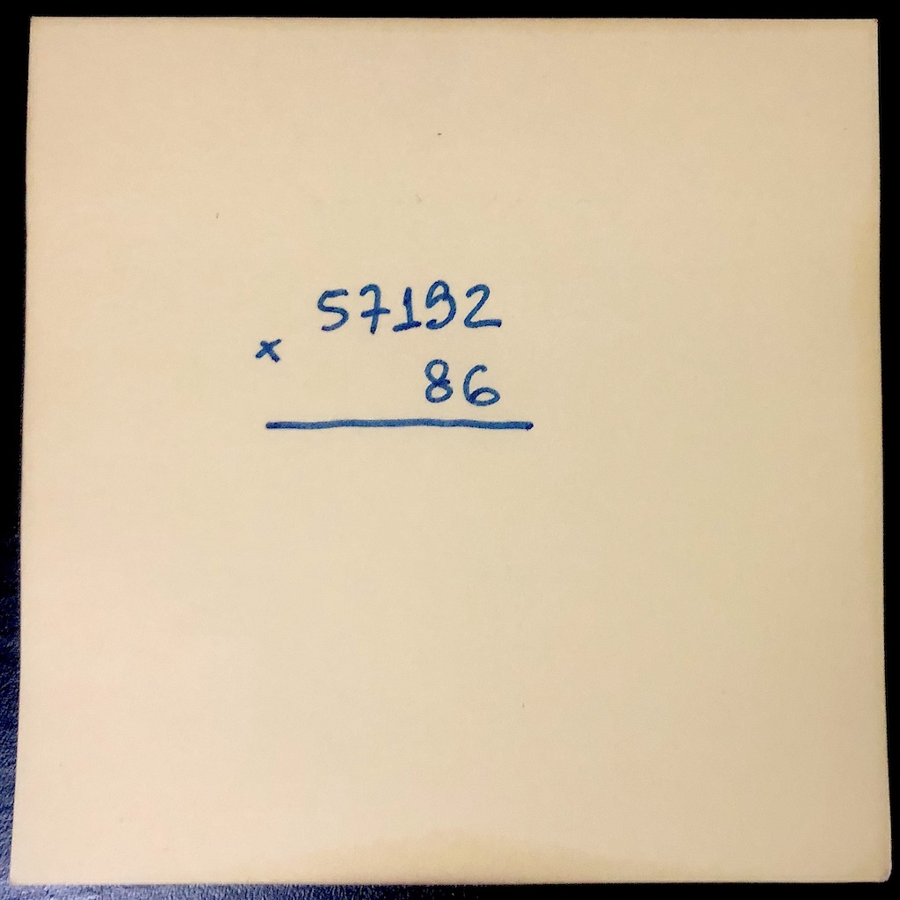
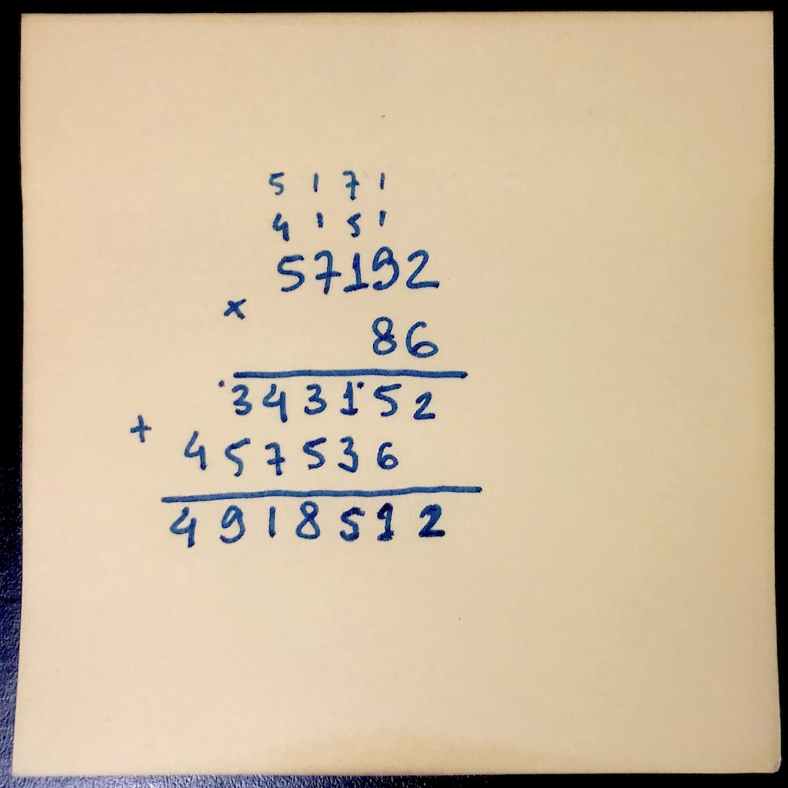

# O que é um microcontrolador?

Um **computador** é uma máquina composta por diversas partes, cada uma especializada em uma tarefa específica relacionada a operação do computador. Essas partes são então integradas para formar um sistema mais complexo, geralmente montando os diversos componentes em uma placa de circuito impresso. Diferentes aplicações requerem o balanço entre diferentes requisitos, por isso vemos uma variedade tão grande de sistemas. Provavelmente você está lendo este texto em um computador de uso geral (um *desktop* ou *notebook*), sistemas cuja principal função é realizar o que chamamos de computação (que definiremos melhor nas próximas sessões).

Em diversos cenários queremos embutir computadores em sistemas cuja finalidade não é servir como uma ferramenta geral de computação. Por exemplo, a função de um veículo é permitir a locomoção de pessoas e cargas, a função de um telefone celular é permitir a comunicação entre pessoas que estão fisicamente distantes, a função de uma geladeira é armazenar alimentos em baixa temperatura. Ainda assim, colocamos computadores nesses equipamentos para automatizar e otimizar seu funcionamento. Ao fazer isso dizemos que o computador está **embarcado** em um outro sistema.

Ao embarcar computadores nos mais diversos sistemas passamos a lidar com as restrições inerentes a estes sistemas e às necessidades da sua aplicação. Um telefone celular precisa ser compacto e consumir pouca energia de forma que possamos utilizar uma bateria de pequeno tamanho e ainda assim conseguir uma autonomia decente. Por outro lado, um telefone celular precisa realizar operações de controle razoavelmente complexas para permitir um bom uso dos recursos de comunicação disponíveis. O computador embarcado em um carro está ali para monitorar um conjunto de sensores espalhados pelo veículo e controlar funções como a quantidade de combustível injetada no motor. A única função de um computador embarcado em um geladeira é monitorar e controlar a temperatura interna do equipamento.

**Microcontroladores** são pequenos computadores integrados em um único chip. Seu projeto procura atender aplicações que envolvem o monitoramento de sensores e a automação do controle de processos. Quando falo em pequenos computadores não quero dizer necessariamente computadores simples, um microcontrolador moderno provavelmente é uma máquina bem mais sofisticada do que aquelas utilizadas para levar o homem para a Lua. Justamente pela extensa gama de aplicações, encontraremos microcontroladores com uma variedade imensa de recursos, mas todos eles compartilham muitos elementos em comum. Ao longo deste livro iremos explorar diversos desses elementos utilizando um microcontrolador específico, o MSP430F5529 fabricado pela Texas Instruments, mas cobriremos os aspectos teóricos de forma que você seja capaz de trabalhar com qualquer tipo de microcontrolador no futuro (claro que com alguma curva de aprendizado). 

## Mas o que é um computador, afinal?

Gostaria de começar analisando o que é um computador do ponto de vista funcional (o que ele faz). A operação de um computador é muito parecida com a operação de uma pessoa realizando determinadas tarefas, por incrível que pareça. Provavelmente o primeiro a parceber isso para construir uma teoria foi o matemático inglês Alan Turing (1912 - 1954), hoje considerado o pai da computação. Em Janeiro de 1937 Turing publicou um artigo intitulado "Sobre números computáveis, com uma aplicação ao problema de decisão" ([*On Computable Numbers, with an Application to the Entscheidungsproblem*](https://londmathsoc.onlinelibrary.wiley.com/doi/abs/10.1112/plms/s2-42.1.230)) em que ele analisa o que um ser humano seria capaz de calcular utilizando papel e caneta. Baseado nessa ideia ele propõe uma máquina abstrata que calcula números e argumenta que essa máquina captura toda a nossa capacidade de realizar desenvolvimentos matemáticos de forma automática (repare que não afirmo que sua proposta seria capaz de capturar toda a matemática que um ser humano seria capaz de fazer, mas captura tudo aquilo que pode ser feito de forma mecânica e automática). Na época em que esse trabalho foi escrito um computador era literalmente uma pessoa que realizava cálculos matemáticos seguindo instruções. A foto a seguir, de 1949, mostra a "sala de computadores" do Comitê Nacional para Aconselhamento sobre Aeronáutica (*National Advisory Committee for Aeronautics* - NACA), uma agência de pesquisa aeroespacial do governo americano.

Vamos fazer o seguinte exercício, pegue uma folha de papel e calcule `5 * 3` (cinco multiplicado por três). Provavelmente você nem precisou do papel para resolver esta conta, é como se houvesse algo na sua cabeça que simplesmente soubesse que o resultado é `15`. Agora calcule `57192 * 86`. Calcule mesmo, no papel, antes de continuar (e não roube usando uma calculadora).

Estou esperando, se você não parar e fizer a conta no papel não vai entender o meu argumento, eu quero que você sinta o que um computador faz. Não prossiga até fazer a conta, lembra que esse livro envolve que você pare e faça o que eu peço pra você fazer?

Ok, estou entendendo que você fez a conta no papel. Provavelmente começou com algo parecido com isso (talvez com uma caligrafia melhor do que a minha)...

e terminou com algo parecido com isso...

Na escola primária você aprendeu um procedimento para realizar qualquer multiplicação: alinhe os dois números a direita, um sobre o outro. Selecione o número mais a direita do número que ficou embaixo (`6`) e multiplique esse número por cada um dos números que estão na linha de cima, anotando o dígito das unidades na linha do resultado e o dígito das dezenas para a próxima multiplicação. Primeiro faça `6 * 2 = 12`, anote o `2` e o `1` você "passa pra frente". Depois, faça `6 * 9 = 54` e some o `1` que "sobrou" do passo anterior para chegar em `55`. Anote o `5` e passe um `5` "para frente.". Repita até multiplicar todos os pares de números. Repita o mesmo processo para o dígito `8`, mas anote os resultados de cada multiplicação "pulando uma casa" na linha de resultados. Ao terminar, some as duas linhas de resultados para obter o número `4.918.512` (pode conferir na calculadora agora...).

Quero que repare bem o que aconteceu pois se você entender isso você vai achar um computador uma máquina quase trivial. Em primeiro lugar, você sabe realizar algumas **operações básicas**, no caso, multiplicações de número com um dígito apenas. No início você nem sabia e ficava provavelmente olhando uma tabela de multiplicação (que chamam de tabuada na escola), mas com o tempo você decorou toda ou a maior parte da tabela. Quando construímos um computador nós escolhemos algumas operações básicas e projetamos o hardware para executá-las.

Segundo, você seguiu um procedimento que usa essas operações básicas para resolver um problema mais complicado. Chamamos esse procedimento de **algoritmo**. Repare uma coisa interessante, provavelmente você nem sabe porque esse algoritmo funciona, mas sabe que se segui-lo corretamente você vai encontrar o resultado certo no final. O computador não precisa saber o que está fazendo (e ele não sabe mesmo), ele simplesmente segue uma sequência de passos que alguém ensinou para ele. Quando **programamos** o computador estamos "ensinando" o computador qual é a sequência de passos utilizadas para resolver um problema espoecífico. O computador não aprende como nós e precisamos de alguma forma codificar a solução de um problema em um formato que ele possa processar, quase como um livro de receitas que o computador vai seguir.

Terceiro, você usou o papel como uma **memória** auxiliar. Você tem uma memória no seu cérebro, você usou ela para lembrar qual é o procedimento que precisava seguir e para lembrar a tabuada para realizar as operações básicas. Entretanto, se você tentar fazer a mesma multiplicação sem o papel provavelmente perceberá que a tarefa fica muito mais difícil, essa memória auxiliar funciona como uma área de trabalho para realizar a tarefa de multiplicar. Um computador também funciona assim, projetamos a máquina com uma memória onde ficam armazenados nossos programas e com uma outra memória que é utilizada para armazenar resultados intermediários, da mesma forma que o papel na multiplicação que acabamos de fazer. Assim como o papel que você usou tem uma capacidade limitada de informações que você pode escrever, a memória de trabalho do computador é bastante limitada e ele acaba precisando realizar diversas operações de leitura de escrita de dados. 

# Referências
